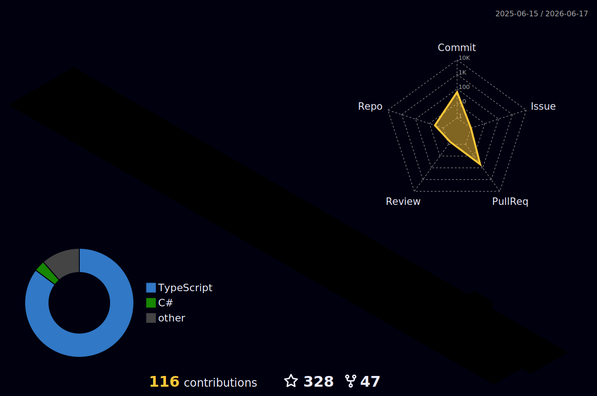

<div align="center">

<a href="https://git.io/typing-svg">
  
</a>
</div>

---

### 👨‍💻 About Me

```yaml
name:      Zhang Tianyao
Nick Name:     企鹅一号 · Penguin No.1
education: [NUS CS (Graduated), HKU MSBA (Incoming)]
building:
  - TeamSpeak Music Bot   → QQ Music API, ESM/CJS interop
  - A-Share Quant System  → GRU momentum, T+1 backtest
  - Arma 3 AI Commander   → LLM + OODA, 489 passing tests
interests:
  - 🎮 Military Sims  · Arma 3 / Reforger / DCS
  - 📸 Cosplay Photography · Arknights · Girls' Frontline · JJK
  - 🤿 Scuba Diving    · PADI Advanced Open Water
  - 🛸 UAV Piloting    · CAAC 超视距 (BVLOS)
  - 📊 Quant Research  · Factor models · Regime detection
reach:     saopig@duck.com
```

🌐 Find Me Elsewhere
<p align="left">
  <a href="https://www.instagram.com/penguinichi.photography/">
    
  </a>
  <a href="https://space.bilibili.com/38410873">
    
  </a>
  <a href="mailto:saopig@duck.com">
    
  </a>
  <a href="https://github.com/ZHANGTIANYAO1">
    
  </a>
</p>

---

###  🛠️ Tech Stack

**Languages**


**Frameworks**


**DevOps**


**Tooling**


---

### 📊 GitHub Stats

<div align="center">


</div>

### 🏆 Trophies

<div align="center">


</div>

---

### 🐍 Contribution Snake

<div align="center">

<picture>
  <source media="(prefers-color-scheme: dark)" srcset="https://raw.githubusercontent.com/ZHANGTIANYAO1/ZHANGTIANYAO1/output/github-snake-dark.svg" />
  <source media="(prefers-color-scheme: light)" srcset="https://raw.githubusercontent.com/ZHANGTIANYAO1/ZHANGTIANYAO1/output/github-snake.svg" />
  
</picture>

</div>

### 🌆 3D Contribution City

<div align="center">



</div>

---

<div align="center">

<sub>Thanks for stopping by! · 感谢到访 · 訪問ありがとう</sub>


</div>
